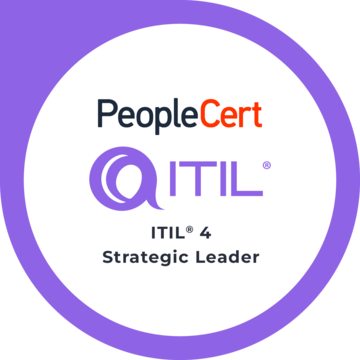
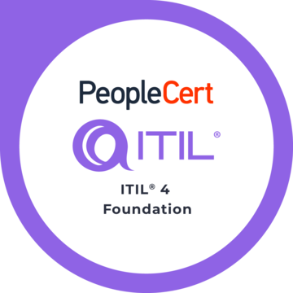
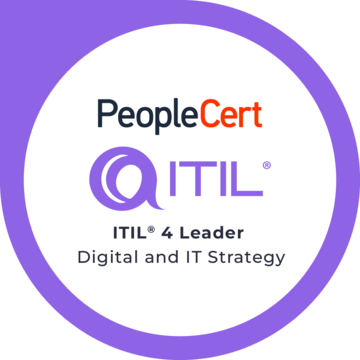
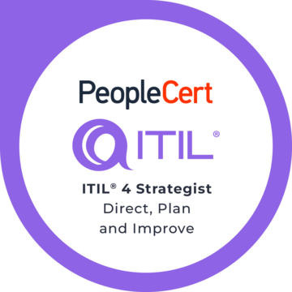
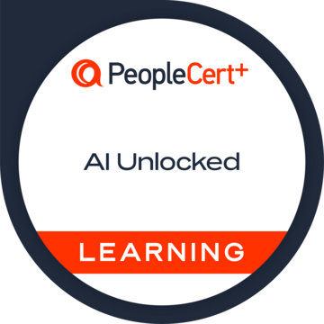
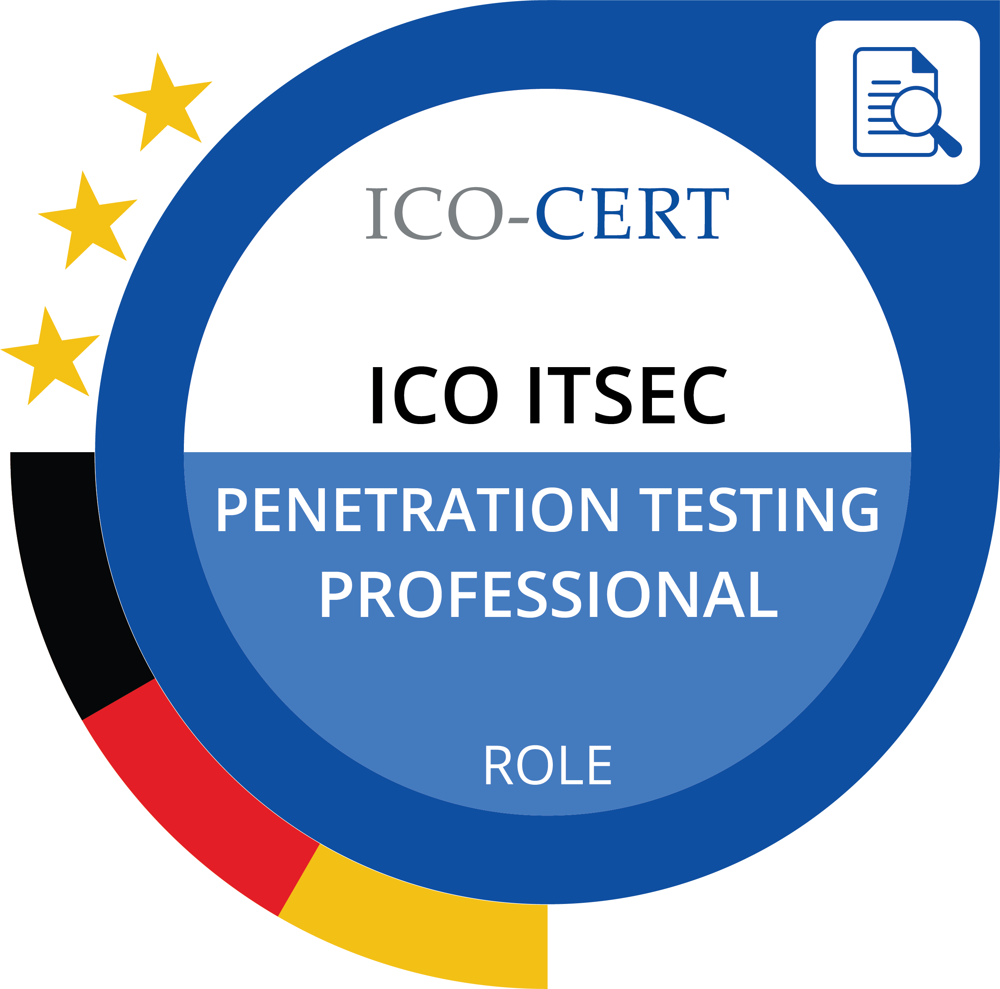
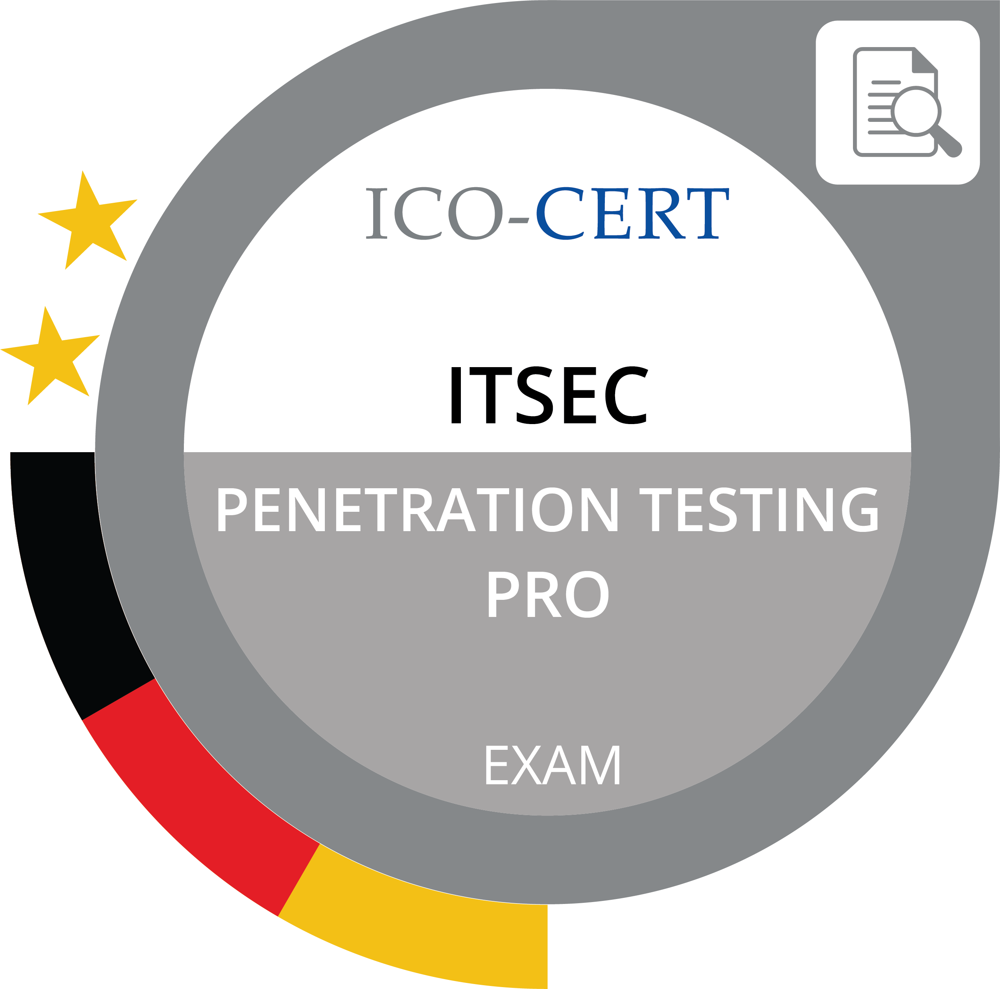

# 👋 Hi, I'm Michael van den Berg

Senior IT Manager and enterprise technology leader working across IT architecture, AI governance, cybersecurity, and digital strategy.  
I act in a role comparable to a *principal IT architect* or *technology strategist*, helping organisations align business needs, technology landscapes, and secure digital capabilities.

---

## 🏆 Certifications

  
  
  
  
  
  
  

### In Progress  
- **IAPP – AIGP (AI Governance Professional)**  
- **PECB – ISO/IEC 42001 Lead Implementer**  
- **PECB – ISO/IEC 42001 Foundation**

---

## 🔭 What I’m currently working on

- Designing and operating a **central organisational AI platform**  
- Establishing **AI governance**, including risk assessment, lifecycle processes and compliance controls  
- Defining **enterprise architecture principles** for secure, scalable IT  
- Supporting digital transformation and IT modernisation initiatives  

---

## 🧑‍💼 Leadership Responsibilities

I lead a cross-functional team responsible for:

- Requirements engineering & demand management  
- GIS systems, ETL processes and business intelligence  
- Enterprise architecture & EAM practice (LeanIX)  
- Solution architecture and technology evaluation  
- Security, quality and compliance within the IT portfolio  

---

## 🧰 Tech Stack

### AI & Automation
- vLLM deployment of small to medium open-source LLMs  
- Custom model training & LoRA/adapter fine-tuning  
- Python-based automation and integration  
- Docker for containerised AI services

### Enterprise & Operations
- SAP S/4HANA & Fiori fundamentals  
- SAP BTP (architectural understanding)  
- PowerShell, Bash, Linux administration

### Architecture & Governance
- Enterprise Architecture with LeanIX  
- ITIL 4 practices  
- AI governance & risk assessment  
- ISO/IEC 42001 (in progress)

### Languages
- Python  
- PowerShell & Bash  
- Java (historical)

---

## 🎓 Selected Professional Training

- ITSec Professional Penetration Testing (ICO-CERT)  
- ITSec Foundation – IT Security & Forensics (TÜV SÜD)  
- ITIL® 4 Strategic Leader (SL, DITS, DPI)  
- IHK Examination Board Member (IT Professions)  
- IHK AEVO – Certified Trainer  

---

## 📫 Contact

- **LinkedIn:** https://www.linkedin.com/in/michael-van-den-berg-1aab94145/  
- **GitHub:** https://github.com/M-vdBerg  

---

> _“Digital transformation requires clarity, governance and purposeful innovation.”_
